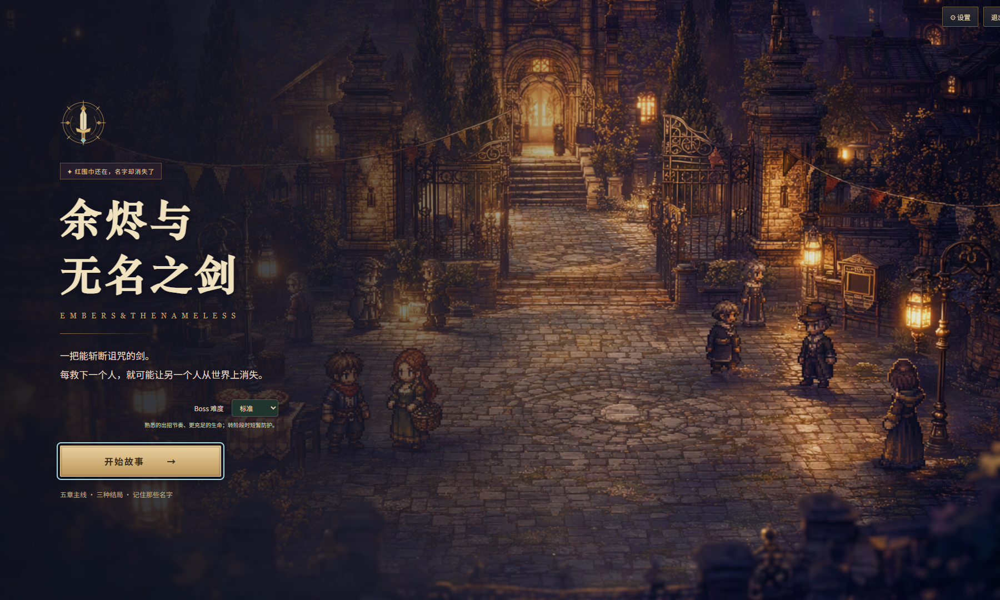

# 余烬与无名之剑

一把能斩断诅咒的剑。每救下一个人，就可能让另一个人从世界上消失。

**Windows 五章可玩试玩版 · 2.2.3**

## 下载与启动

| 下载 | 启动方法 |
| --- | --- |
| [免安装版（推荐）](https://github.com/OGAS19171976/embers-and-the-nameless-sword/releases/download/v2.2.3/NamelessSword-2.2.3-Portable.exe) | 下载后双击；首次启动会解压运行环境 |
| [安装版](https://github.com/OGAS19171976/embers-and-the-nameless-sword/releases/download/v2.2.3/NamelessSword-2.2.3-Setup.exe) | 运行安装程序，再使用快捷方式 |
| [操作说明](https://github.com/OGAS19171976/embers-and-the-nameless-sword/releases/download/v2.2.3/NamelessSword-2.2.3-Guide.md) | 查看按键、难度与存档说明 |

[全部下载与版本说明](https://github.com/OGAS19171976/embers-and-the-nameless-sword/releases/latest) · [SHA-256 校验值](SHA256SUMS.txt)

Windows 10 / 11，64 位；自带运行环境，游戏可离线运行。

## 游戏内容

- 五章主线与三种结局，旅途地图、任务和自动存档。
- 剑术与魔法、人物与怪物首领、三阶段 Boss、光粒和战斗特效。
- 剧情、标准、困难、噩梦四档难度。标准以上加强首领耐久与阶段转换，困难以上强化连招和弹幕。
- 右手集中操作：J 普攻、K 魔法、L 剑气，U/I/O 旋风斩/突刺/招架，H 挑月、N 重斩。
- WASD 移动、Shift 奔跑、空格闪避，T/Y 药品、Tab 手册、M 地图。
- 画质、全屏、音乐与音效设置，14 首配乐、26 个音效和 5 组环境音。

## 更新与存档

更新前关闭旧版本。安装版与免安装版共享当前 Windows 用户的进度；设置中可以导出、导入存档，旧版 v2 存档兼容。

## 本次发布检查

已检查免安装启动、离线保存、旧存档导入、右手按键与难度切换；216 组首领动作/阶段/难度组合与 32 项剧情检查通过。安装包内嵌文件与实测桌面版逐文件一致；安装向导未在本机交互安装。

此仓库提供下载说明与发布文件。游戏依赖的第三方许可证随运行包附带。
